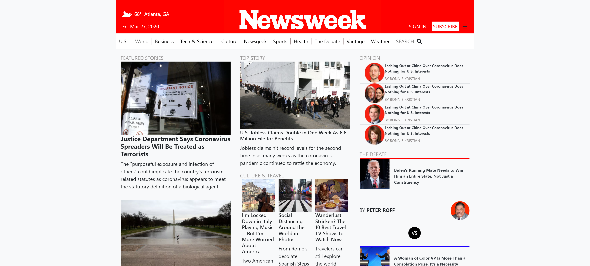

# firts boostrap page

Created a clone page of the newsweek front page making use of boostrap 

## Built With

- HTML, CSS.

## Authors

👤 Ricardo Vera

- Github: [@ricardo123321](https://github.com/ricardo123321)
- Twitter: [@ricardo615920830](https://twitter.com/ricardo615920830)
- Linkedin: [linkedin](https://www.linkedin.com/in/ricardo-vera-7381a81a2/)

## 🤝 Contributing

Contributions, issues and feature requests are welcome!

Feel free to check the [issues page](issues/).

## Show your support

Give a ⭐️ if you like this project!

## Live Demo
[Live Demo Link](https://raw.githack.com/ricardo123321/Using-Bootstrap/features/index.html)

## Acknowledgments

-the code reviewer
